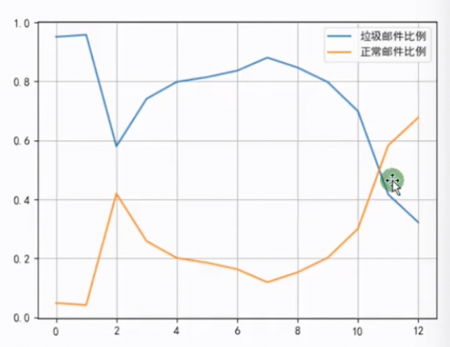
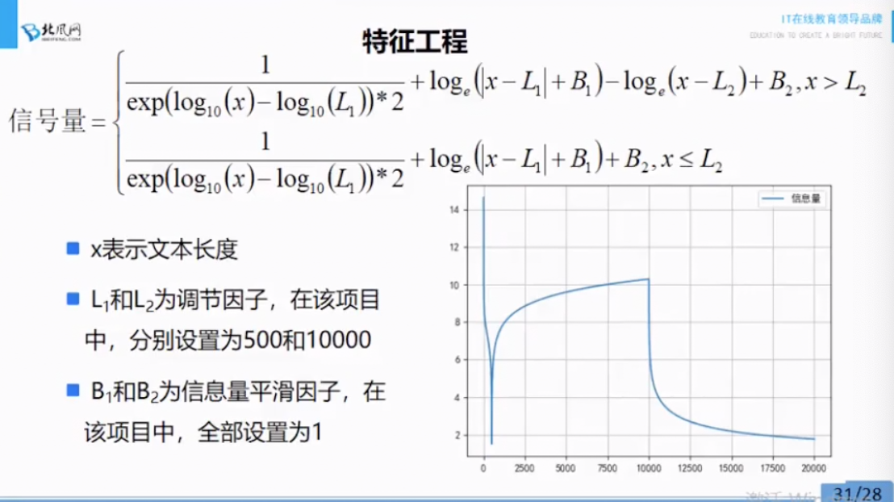
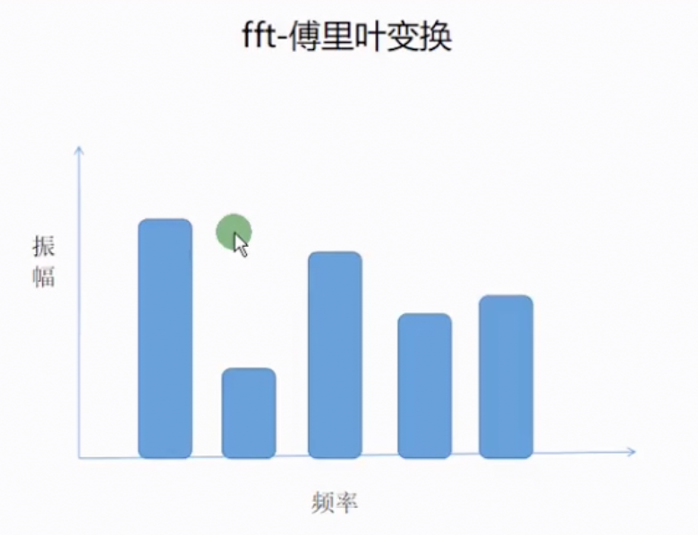
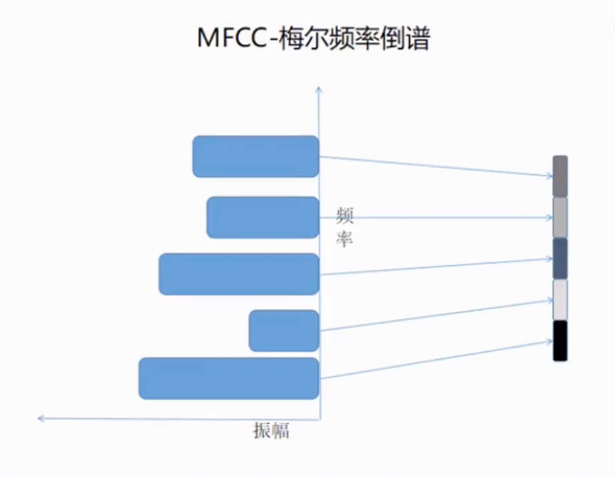
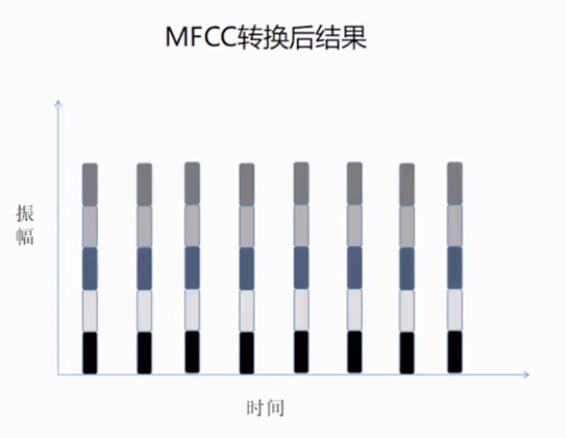
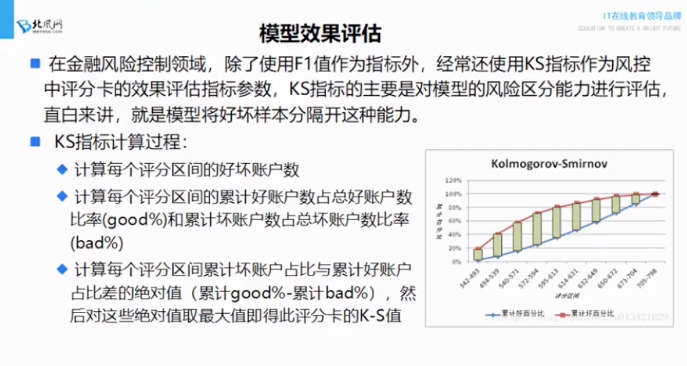
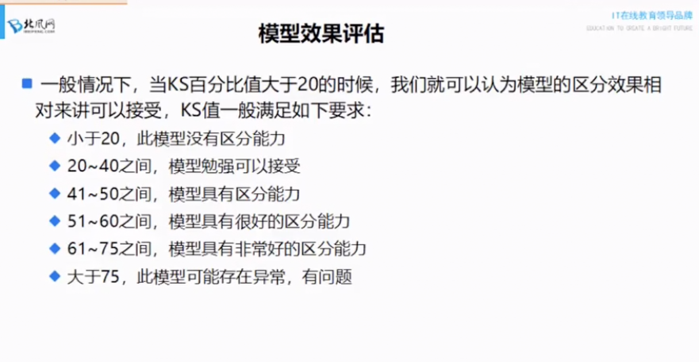

短文本——贝叶斯好
长文本——深度神经网络
训练集验证集7:3

softmax
sigmoid,
logistic,
svd,pca一定要懂
BernoulliNB的参数意义
傅里叶变换
mfcc


# 机器学习
AdaBoost,GBDT都改变了数据集

AdaBoost：改变了样本的权重
GBDT：改变了样本的值(Y的残差)


# 垃圾邮件过滤：
分析：from，to，data，长度，文本信息

## 代码过程：
1. 数据预处理（非格式化的数据格式化）
    1. 生成对应标签y，y取值为0，1
    2. 提取数据中的from,to,content
    3. 组合from,to,content,y，替换掉英文逗号，用英文逗号链接成一行字符串存储起来，content的逗号要换成空格

2. 提取特征：

    1. 添加字段from_address,to_address记录邮件域名地址
    2. 分析from_address,to_address的域名个数和个数最多的前几个域名。to_address基本都一样是用户个人邮箱，所以该字段没啥意义。from_address前几名比较均匀，无法用于区分是不是垃圾邮件（其实我不太认同这个观点，应该from_address和y结合在一起来判断from_address有没有意义）
    3. 分析date的格式类型有哪些，分别处理提取日期为,周几（date_week)，时(date_hour)，时间段(date_time_quantum)。用0-3表示不同时间段

    | date_hour | date_time_quantum |
    | --- | --- |
    | <8 | "3" |
    | <13 | "0" |
    | <19 | "1" |
    | else | "2" |
    
    4. 分析每个星期几(date_week)正常邮件和垃圾邮件个数，每天邮件数以及其中的垃圾邮件和正常邮件比例近似，不同时段(date_hour,date_time_quantum)也是同样情况。所以判断date对判断是否为垃圾邮件没什么用
    5. 增加字段has_date，date_week不为空时为1，为空时为0.一般垃圾邮件has_date为0.但总体认为时间对邮件分类影响不大
    6. 对content信息进行jieba分词，用空格连接各词存储为jieba_cut_content,统计邮件长度为content_length，标记为不同的长度类型，存储为content_length_type,标记列表如下

    | 长度 | 标记 |
    | --- | --- |
    | <=10 | 0 |
    | <=100 | 1 |
    | <=500 | 2 |
    | <=1000 | 3 |
    | <=1500 | 4 |
    | <=2000 | 5 |
    | <=2500 | 6 |
    | <=3000 | 7 |
    | <=4000 | 8 |
    | <=5000 | 9 |
    | <=10000 | 10 |
    | <=20000 | 11 |
    | <=30000 | 12 |
    | <=50000 | 13 |
    | else | 14 |

    7. 统计不同长度类型下，垃圾邮件和正常邮件数目，并计算各自占比，记为c1_rage,c2_rage.画图观察，
    
    7. 从图上看出有点用，保留。找一个函数来拟合邮件长度和垃圾邮件占比关系，
    
    根据该函数得到新字段content_length_sema
    8. 至此保留has_data,jieba_cut_content,content_length_sema,label。3个属性和1个label，
    保存为新的csv

3. 建立模型
    1. 读取csv,删除有nan的行
    2. 数据集训练集和测试集切分
    3. 用TfidfVectorizer(norm='l2',use_idf=True)对jieba_cut_content进行fit和transform处理
    4. 再对第三步的结果进行TruncatedSVD(n_components=20)降维
    5. 用BernoulliNB(alpha=1.0,binarize=0.0005)对数据进行建模训练
    6. 验证测试集，贝叶斯模型精确率：0.94640，召回率：0.98831，f1：0.96690，用时：0.04s。模型快，效果还好
    7. 决策树，随机森林，KNN等比较。随机森林精确率：0.94670，召回率：0.98985，f1:0.96779，用时：0.05s


# 音乐文件分类

**重点**： 音频转化为数值，MFCC(Mel Fequency Cepstral Coefficents)梅尔频率倒谱系数。原理是
傅里叶变换加梅尔倒谱。把某一时刻的音频傅里叶变换拆解为多个频率，再倒谱一下，变成时间和频率的图






**重要的包**

```python3
# 读取音频文件
from pydub.audio_segment import AudioSegment
# 把mp3格式转换为wav格式
from scipy.io import wavfile
# 做傅里叶变换和梅尔倒谱系数使用
from python_speech_features import mfcc
```

## 代码步骤
1. 用AudioSegment读取mp3文件并导出为wav文件
2. wavfile读取wav文件，给mfcc处理
    ```
    rate,data = wavfile.read('./data/3D音效音乐/擦肩而过.wav')
    mf_feat = mfcc(data,rate,numcep=13,nfft=2048) # 傅里叶变换+梅尔倒谱
    ```
3. mf_feat是42161*13的矩阵，表示一首歌的特征，需要降维（pca,lda).老师的处理方式是求列的均值，变成1*13的列，再结合13列的两两协方差，共91个值。得到总共1*104维的特征
4. 把标签变为数值，提取所有歌曲特征及标签，存储为csv
5. 用GridSearchCV网格交叉验证svm.SVC(random_state=0).最优时参数为kernel:"poly",decision_function_shape:"ovo",C:0.1,probability:True。测试集正确率100%，验证集最优的44.83%
6. 保存最优模型joblib.dump

# 金融反欺诈

行规：逻辑回归和ks指标
使用的开源数据
关注精准率，相比召回，精准更重要

**KS指标：**
ks是评估模型区分能力的





35-60比较可信

大体过程：在训练集上得到w,b，wx+b进行sigmoid得到0-1的值，分成多个区间，每个区间上找正例负例数，做成ks指标

LogisticRegress 确定出θ
然后写出sigmoid = 1/(e^(-θx)+1)
每个样本就对应0-1的一个数
用ks确定一个最合适的阈值
下次给个样本x，算出sigmoid>阈值，判断为正例，小于阈值判断为负例

## 代码步骤
1. 删除空列，数据种类唯一的列，对分类无意义的列，线性相关的列
2. 多余字符串替换掉，比如"36 months"变成36
3. float类型的列，数据种类却很少的（4w多条数据，只有几十种数值），删除
4. 删除object类型中，数值较为单一的列，对模型没用的列
5. 处理样本标签,"Fully Paid"变为1，"Charged Off"变为0，其余的删除对应行数据
6. 保险起见，把数据中的nan空值填充为0，此时剩余18列
7. 进一步降维：计算18列的相关系数，相关性大于0.95的列，删除其中一列
8. 亚变量处理：df = pd.get_dummies(df)。
9. 最终数据保存到csv
10. 放入模型训练。逻辑回归训练集效果：f1_mean:0.9987,精确率：0.9978，查全率：0.9978，
逻辑回归测试集效果：f1_mean:0.9984,精确率：0.9973，查全率：0.9969
随机森林训练集效果：f1_mean:1.000,精确率：1.000，查全率：1.000，
逻辑回归测试集效果：f1_mean:0.9993,精确率：0.9988，查全率：0.9987

说明：及时把权重重要的列删除，模型效果依然很好，模型不会坍塌，极其鲁邦。


# 新闻分类

1. 制造词汇表，词汇表id化，标签id化
2. input_x: int32,[None,seq_length],[None,600]
    input_y: float32, [None,num_classes],[None,10]
    keep_prob: float32,

    embedding: [vocab_size,embedding_dim],[4998,64]
    embedding_inputs: tf.nn.embedding_lookup(embedding,input_x),[None,seq_length,embedding_dim],[None,600,64]

    cells = [BasicLSTMCell + DropoutWrapper  for 层数]
    rnn_cell = MultiRNNCell(cells,state_is_tuple=True)
    _outputs,_ = dynamic_rnn(cell=rnn_cell,inputs=embedding_inputs,dtype=tf.float32)
    last = _outputs[:,-1,:]

    全连接为128维度：fc = dense(last,hidden_dim)
    dropout:  fc = tf.contrib.layers.dropout(fc,keep_prob)
    relu: fc = tf.nn.relu(fc)

    再全连接为10个维度：logits = dense(fc,num_classes)
    预测结果：tf.argmax(softmax(logits),1)

    损失函数（交叉熵）cross_entropy = softmax_cross_entropy_with_logits(logits=logits,labels=input_y)
    loss = tf.reduce_mean(cross_entropy)

    优化器：optim = tf.train.AdamOptimizer(learning_rate=learning_rate).minimize(loss)

    准确率

    尝试改变为2层双向的效果


1. 配置：

| 名字 | 配置 |
| --- | --- |
| 词向量维度 | 64 |
| 序列长度 | 600 |
| 类别数 | 10 |
| 词汇表大小 | 5000 |
| 隐藏层层数 | 2 |
| 隐藏层神经元 | 128 |
| rnn | gru |
| dropout | 0.8 |
| 学习率 | 1e-3 |
| bitchsize | 64 |
| epochs | 10000 |
| 输出频次 | 100 batch |
| 保存频次 | 10 batch |


====深度学习====

修改学习算法的方法：
通过增加或减少学习算法可选假设空间的函数来增加或减少模型的容量。所列举的一个具体示例是线性回归增加或减少多项式的次数。

我们可以通过两种方式控制算法的性能，一是允许使用的函数种类，二是这些函数的数量。
表示对函数的偏好是比增减假设空间的成员函数更一般地控制模型容量的方法。我们可以将去掉假设空间中的某个函数看作对不赞成这个函数的无限偏好。
有很多其他方法隐式或显式地表示对不同解的偏好。总而言之，这些不同的方法都被称为正则化（regularization）。正则化是指修改学习算法，使其降低泛化误差而非训练误差。正则化是机器学习领域的中心问题之一，只有优化能够与其重要性相提并论。

