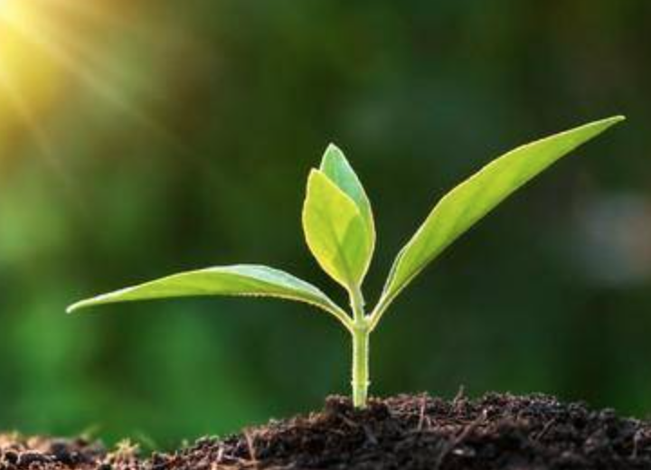
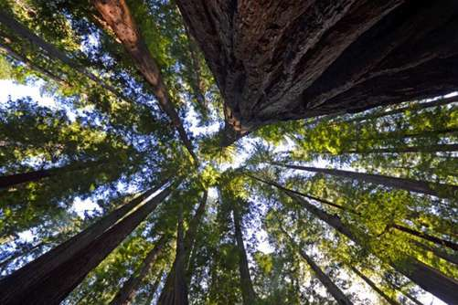
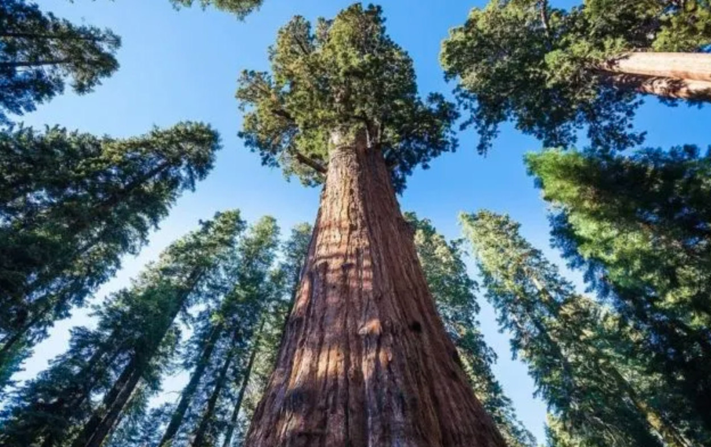
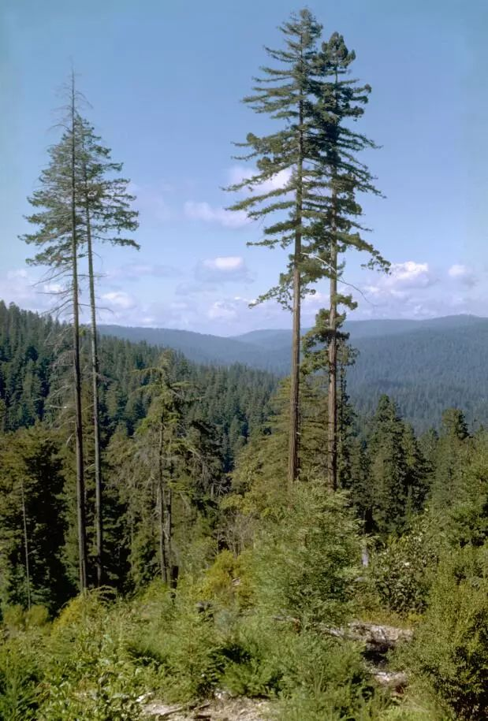

# 简介

小时候以为存在一个人生的意义，每个人都以之为目的，可我却不知道哪个意义是什么，也没人告诉我。

多年以后才明白，根本没有这么个东西存在，即使存在，也不是一个唯一的、确定的东西。每个人都可以选择不同的人生意义，也可以创造新的意义，亦可实时改变之，当然，也可以无需意义。

明白了这点之后，我就释然了，原来权利在我手中，我可以自由涂画我的人生。那么，我想要怎样的生活呢？

|||
|-|-|
|  |  |
|  |  |

一段时间之后，我找到了一种感觉。我想象到自己像一株刚破土的幼苗，对这个世界充满了欣喜和渴望，想要把枝叶竭力地绽开，极尽热情地去拥抱阳光及雨露。周围充满了高耸入云的参天大树。我渴望着有一天，我也能顺着枝叶间的阳光，成长出属于自己的独特芳华。在这享受成长的道路上，能同群邻共语，可与风雨相惜，若能再护及足下幼苗、览万里云空，那真是齐天之幸，奢望至极了。

所以，把这个空间取名“成长”。因为目标无需实现，过程即是全部。子曰：好之者不如乐之者。乐享过程即可，这就是我对人生意义的答案。
