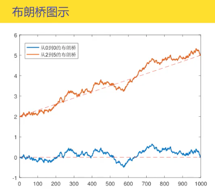
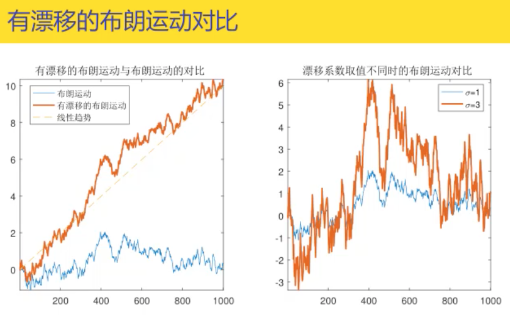

## 随机游走

假设一个粒子每隔$$\Delta t$$时间做一次向上或向下运动，向上运动概率为p，移动距离为1个单位，记为1；向下运动概率为q=1-p，移动距离也为1个单位，记为-1。

将每次粒子的位移记作随机变量$Z_i$，$i$表示移动的次数。相应粒子的上下运动称作随机游走（random walk）。

* $$P(z_i=1)=p$$
* $P(z_i=-1)=q=1-p$

假设随机变量$Z_i$是对立同分布的，当$t=n\Delta t$时，我们将t时间段内粒子的位移记作$X(t)$,则有：

* $X(t)=Z_1+Z_2+\dots+Z_n$
  * $E[Z_i]=p-q$
  * $Var[Z_i]=4pq$
  * $E[X(t)]=n(p-q)$
  * $Var[X(t)]=4npq$

## 对称随机游走

粒子上下运动的概率均为1/2,此时的随机游走称为对称随机游走

* $E[X(t)] = n(p-q)=0$
* $Var[X(t)] = 4npq = n$
* 其中$n=t/\Delta t$，是t时间段粒子位移次数

粒子位移$z_i$

* $E[Z_i]=0$
* $Var[Z_i]=1$

截止t时刻的对称随机游走的**二次变差**（quadratic variation）定义：

$<X,X>(t)=\sum_{i=1}^n (X_i-X_{i-1})^2 = n$，因为增量$Z_i = X_i-X_{i-1} = \pm 1$

* $<X,X>(t)=n$与随机游走中上下运动概率无关
* $Var[X(t)]=n$成立的前提是对称随机游走，即$p=q=1/2$
* 二次变差$<X,X>(t)$是沿着随机游走的**单条路径**计算的
* 方差$Var[X(t)]$是对**所有路径**，以其概率权重求平均得到的

## 按比例缩小型对称随机游走

t时间段位移n次，每个时间段$\Delta t = t/n$。再等距划分m段，移动mn次，位移由$Z_i$变为$W^{(m)}(s)=\frac{1}{\sqrt{m}} Z_{ms},s\in[0,t]$

* $E[W^{(m)}(s)] = 0$
* $Var[W^{(m)}(s)]=(\frac{1}{\sqrt{m}})^2*1 = \frac{1}{m}$

[s,t]内独立增量，发生了m(t-s)次位移

* 下面求的独立增量是指$W^{(m)}(t)-W^{(m)}(s)=\sum_{n=1}^{m(t-s)} W^{(m)}(·)$

* $E[W^{(m)}(t)-W^{(m)}(s)]= \sum_{n=1}^{m(t-s)} E[W^{(m)}(·)]=\sum_{n=1}^{m(t-s)} 0=0$
* $Var[W^{(m)}(t)-W^{(m)}(s)]=\sum_{n=1}^{m(t-s)}Var[W^{m}(·)]=\frac{1}{m}* m(t-s)=t-s$

## 布朗运动

按比例缩小型随机游走中$m\rightarrow\infty$时，随机游走就变成了布朗运动

根据中心极限定理，当固定$t\ge0$时，$W^{(m)}(t)$在时刻t取值的分布将收敛于均值为0，方差为t的正态分布

定义：对于随机过程$\{W(t),t\ge 0\}$，若满足一下4个条件，则称$W(t)$为标准布朗运动，简称布朗运动

* $W(t)$连续且$W(0)=0$
* $W(t)\sim N(0,t)$
* $W(s+t)-W(s)\sim N(0,t)$
* $W(t)$是独立增量(independent increments)过程

性质

* 布朗运动具有平稳增量，增量$W(s+t)-W(s)$服从的分布与初始时间s无关，只与时间变化t有关
* 若$0\le s1 < t1 \le s2 <t2$，
  * 则$W(t1)-W(s1)$和$W(t2)-W(s2)$两个增量是独立的
  * $Cov[W(t1)-W(s1),W(t2)-W(s2)]=0$
  * $E[W(t1-s1)W(t2-s2)]=0$
* $E[W(t)]=0$
* $Var[W(t)]=t=E[W^2(t)]$
* 若$s<t$，则$Cov[W(s),W(t)]=E[W(s)W(t)]=s\land t=s$ ($\land$是取min,$\lor$是取max的意思)

### 布朗运动的变换

对于布朗运动$W(t)$，如下变换的随机过程$X(t)$仍然是布朗运动：

* 反射变换（reflection）：$X(t)=-W(t)$
* 平移变换（translation）：$X(t)=W(t+s)-W(s)，\forall s \ge 0$
* 缩放变换（rescaling）：$X(t)=\frac{1}{\sqrt{a}} W(at),\forall a > 0$
* 反转变换（inversion）：$X(t)=tW(1/t),t>0$；并且$X(0)=0$

### 布朗运动的瞬时增量

$W(t+\Delta t)-W(t)\sim N(0,\Delta t)$

当$\Delta t \rightarrow 0$时，定义：$dW(t)=\lim_{\Delta t \rightarrow 0} W(t+\Delta t)\sim W(t)$为$W(t)$的瞬时增量

$dW(t)\sim N(0,dt)$

性质：

* 求导$\frac{dW(t)}{dt}=\lim_{\Delta t \rightarrow 0}\frac{W(t+\Delta t)-W(t)}{\Delta t}$
* $E[\frac{W(t+\Delta t)-W(t)}{\Delta t}]=\frac{1}{\Delta t} E[W(t+\Delta t)-W(t)]=0$ 
* $Var[\frac{W(t+\Delta t)-W(t)}{\Delta t}]=\frac{1}{(\Delta t) ^2} Var[W(t+\Delta t)-W(t)]=\frac{1}{\Delta t} $ 
* 当$\Delta t \rightarrow \infty, Var[\frac{W(t+\Delta t)-W(t)}{\Delta t}] \rightarrow \infty$，意味着微商取值可以是任意大的数值，可见$W(t)$的导数不存在。也决定了**布朗运动轨迹不是光滑的**
* **$W(t)$处处连续，处处不可导**

### 布朗运动的变差

* 一次变差：$\lim_{n\rightarrow \infty} \sum_{k=0}^{n-1} |W(t_{k+1})-W(t_k)| = \infty$
* 二次变差：$<W,W>(t):=\lim_{n\rightarrow \infty} \sum_{k=0}^{n-1} (W(t_{k+1})-W(t_k))^2 = t$。可记为$dW(t)·dW(t)=dt$
* 高阶变差：$\lim_{n\rightarrow \infty} \sum_{k=0}^{n-1} (W(t_{k+1})-W(t_k))^p = 0$

光滑函数二次变差为0，布朗运动二次变差不为0

### 布朗运动首中时刻

对于常数$a$,用$\tau_a$表示布朗运动的质点首次到达位置a的时刻，即：$\tau_a = \min\{t:t\ge 0,W(t)=a \}$，则称$\tau_a$为首中时刻或首达时间。

首中时刻$\tau_a$是一个随机变量，就是随机过程当中所提及的停时（stopping time)，具有强马氏性

* 由布朗运动对称性得：$P(W(t)>a | \tau_a<t) = P(W(t)<a| \tau_a<t) = 1/2$
* $P(W(t)>a,\tau_a<t)=P(W(t)>a)$，布朗运动超过a,首中时刻必然小于t
* 因为$W(t)\sim N(0,t)$，所以$Z(t)=\frac{W(t)}{\sqrt{t}}\sim N(0,1)$
* $a>0$时，$P(\tau_a<t)=2*P(W(t)>a)=2P(Z>\frac{a}{\sqrt{t}})=2\int_{a/\sqrt{t}}^\infty \frac{1}{\sqrt{2\pi}} exp[-\frac{x^2}{2}] dx$。
* $a<0$时，$P(\tau_a <t)=2*P(W(t)<a)=2P(Z<\frac{a}{\sqrt{t}})=2P(Z>-\frac{a}{\sqrt{t}})=2\int_{-a/\sqrt{t}}^\infty \frac{1}{\sqrt{2\pi}} exp[-\frac{x^2}{2}] dx$
* 综合两式可得分布函数：$F_{\tau_a}(t)=P(\tau_a<t) = 2\int_{|a|\sqrt{t}}^{\infty} \frac{1}{\sqrt{2\pi}} exp [-\frac{x^2}{2}]dx = 2*N(-\frac{|a|}{\sqrt{t}})$

性质：

* $P(\tau_a<\infty) = \lim_{t\rightarrow\infty}P(\tau_a<t)=\lim_{t\rightarrow\infty}2N(-\frac{|a|}{\sqrt{t}})=2N(0)=1$。**任意位置a，布朗运动均能以概率1到达**
* 密度函数$f_{\tau_a}(t)=\frac{dF_{\tau_a}(t)}{dt}=\frac{1}{\sqrt{2\pi}} exp[-\frac{a^2/t}{2}]·|a|·\frac{1}{2} t^{-3/2}=\frac{|a|}{\sqrt{2\pi t^3}} exp[-\frac{a^2}{2t}], t>0$
* $E(\tau_a)=\int_{0}^{\infty} t·f_{\tau_a}(t) dt = \int_0^\infty \frac{|a|}{\sqrt{2\pi t}} exp[-\frac{a^2}{2t}] dt$
* 对于任意$a$，均有$E[\tau_a]=\infty$，因此：**首中时刻的期望值为无穷大**

总结：

* $\tau_a$分布函数：$F_{\tau_a}(t) = P(\tau_a<t)=2·N(-\frac{|a|}{\sqrt{t}})$
* $\tau_a$密度函数：$f_{\tau_a}(t)=\frac{|a|}{\sqrt{2\pi t^3}} exp[-\frac{a^2}{2t}],t>0$
* $E(\tau_a)=\infty$
* $P(\tau_a<\infty)=1$

## 反射原理

布朗运动在首中时刻$\tau_a$后发生了反射，由此所构成的路径也是布朗运动

定义：考虑一个随机过程$\widetilde{W}(t) = \begin{cases} W(t), & t\in [0,\tau_a] \\ 2a-W(t), &t\in [\tau_a,\infty] \end{cases}$

我们称$\widetilde{W}(t)$是在$\tau_a$时刻发生反射的布朗运动

## 布朗运动最大值

称$M_t = \max_{t\in[0,T]} W(t)$为布朗运动在$[0,T]$上的最大值

事件：

* $\{M_t > a\}=\{M_t > a,W(t)>a\} \cup\{M_t > a, W(t)\le a\}$

* $\{M_t>a,W(t)>a\}=\{W(t)>a\}$

概率：

* $P(M_t>a)=P(W(t)>a)+P(M_t>a,W(t)\le a)$
* $P(M_t>a,W(t)\le a) = P(M_t>a,\widetilde{W}(t)\ge a) = P(\widetilde{W}(t)\ge a)$
* $P(\widetilde{W}(t)\ge a) = P(W(t)\ge a)$
* $P(M_t>a) = P(W(t)>a) + P(W(t)\ge a) = 2P(W(t)>a)$

布朗运动最大值$M_t$的分布函数：

$F_{M_t}(a) &=  P(M_t<a)=1-P(M_t>a) \\ &=1-2P(W(t)>a) \\ & =1-2P(Z>\frac{a}{\sqrt{t}}) \\ & =1-2N(-\frac{a}{\sqrt{t}})=2N(\frac{a}{\sqrt{t}}-1) \\ & =\int_{-a/\sqrt{t}}^{a/\sqrt{t}} \frac{1}{\sqrt{2\pi}} exp[-\frac{1}{2} x^2] dx$

## 布朗运动的变化形式

### 布朗桥定义1

假设$W(t)$为布朗运动，令$W^*(t) = W(t)-tW(1),t \in [0,1]$为布朗桥

布朗桥两个端点是固定的$W^*(0)=W^*(1)=0$

假设$0\le s\le t \le 1$

* $E[W^*(t)]=0$
* $Cov[W^*(s)W^*(t)]=s(1-t)$

### 布朗桥定义2

假设$W(t)$为布朗运动，令$X(t) = W(t)-\frac{t}{T}W(T),t \in [0,T]$为布朗桥

$X(0)=X(T)=0$

### 布朗桥定义3

假设$W(t)$为布朗运动，给定$T>0,a,b\in R$,则在$[0,T]$上从a到b的布朗桥$X^{a\rightarrow b}(t)$定义如下：

$X^{a\rightarrow b}(t) = a+(b-a)·\frac{t}{T}+X(t), t\in [0,T]$,其中$X(t)$为定义2中的布朗桥

$X^{a\rightarrow b}(0)=a, X^{a\rightarrow b}(T)=b$

### 有漂移的布朗运动

假设$W(t)$是一个布朗运动，则以下随机过程$X(t)=\mu t + \sigma W(t), t\ge 0$为有漂移的布朗运动，常数$\mu$称为漂移系数(drift)，常数$\sigma$称为波动率（volatility）

$E[X(t)]=\mu t$

$Var[X(t)]=Var[\mu t + \sigma W(t)] = Var[\sigma W[t]]=\sigma^2 t$，因为$\mu t$是常量，所以方差为0

方差与漂移项无关，且与波动率$\sigma$的平方值成正比

### 几何布朗运动（GBM）

假设$W(t)$是漂移系数为$\mu$，波动率为$\sigma$的布朗运动，即：$X(t)=\mu t + \sigma W(t)$

定义过程$G(t)$，其满足：$G(t)=G(0)\exp[X(t)],t\ge 0$，并且$G(0)>0$,则称$G(t)$为几何布朗运动（geometric Brownian motion）

几何布朗运动是一个非负过程，可以用来对股票等金融资产建模：

对$G(t)$取自然对数，可得：$\ln G(t) = \ln G(0) + X(t)$，相应的

* $E[\ln G(t)] = \ln G(0) + \mu t$

* $Var[\ln G(t)] = Var[X(t)] = \sigma ^2 t$

## 重要定理

$[dW(t)]^2 = dt$
