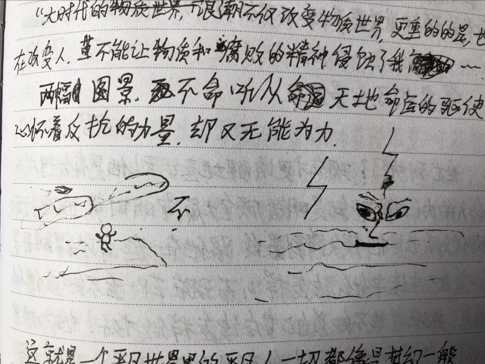

# 2008年2月18日

一切都那么分明，爱情就是爱情，工作就是工作，家庭也绝对是家庭，孙少平的一切都那么分明，为什么，我不能把我所要做的事分明！

夸！有什么好夸的！有什么好炫耀的，一切都还没有定局！就算有了……

“大时代的浪潮不仅改变物质世界，更重要的是，也在改变人，不能让物质和腐败的精神侵蚀了我

两幅图景，不要听从天地命运的驱使。心怀着反抗的力量，却又无能为力。

这就是一个平凡世界里的平凡人，一切都像是梦幻一般。

如果晓霞没死，如果王师傅还活着，一切当然不会有如此的结局，但这又怎会是人为的呢！为了爱——人性美的精华，才让两个如此优秀的人都离开了，”我的爱人，我的师傅，为什么都走了“。不，他们都将长久地活在我的心中，每一个地方不都有关怀着我的人吗？对，关怀着我的人，这便是人世间的大爱，大爱却是无声！

平凡的世界中有太多的苦恼，人生当然不能缺乏这个。改变吗？不，这是一个恒久的问题，但也不是无法改变的问题。共产主义社会，当然也不能完全解决，如感情方面的问题。但绝对可以解决极大一部分问题。

现在考虑一下现实吧！激情动荡吧！你也该有他一样吃苦耐劳的精神，这是最基本和必要的。但一切都在于行动之上。