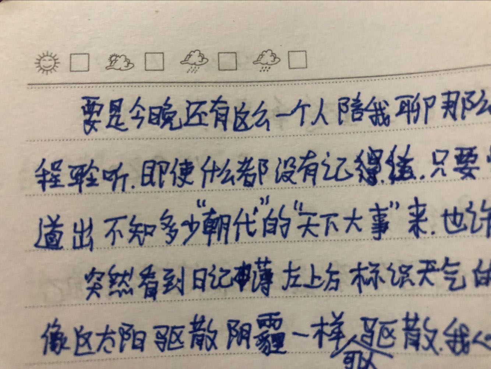

# 2012年10月4日

今晚突然感觉自己是如此孤单、空虚和寂寞。即便阅读也无法排解心中的淤闷，唯有写点东西或可稍解几分，而此时突然想到一个人，她的话可真多，仔细想想，应该是我认识的人中说话最快、最多的吧！

记得有一次在教室里碰到她，那是研究生的小教室，里面没有其他人。我也记不起自己到那个教室是干嘛去了！只记得自己开始和她聊天，实际上我只是在引出话题时才说一两句！全程都是她的“天下”，我只是一个安静的聆听者，她说的话好快，好多！几乎从没停下，这大概就是所谓的“连珠炮“吧！但还好自己的反应更快，从容地聆听而没拉下一句！虽然现在只记得个别内容！

中途我好想还劝她喝点水，怕她口渴！当聊完天要走的时候，我感觉时间似乎已过去很久，已到了另一个”无论魏晋“的时代！是因为从她小时候聊到现在的缘故，还是她说的真的很久很多？

要是今晚还有这么一个人陪我聊那么多，那么久，即使再一次全程聆听，即使什么都没有记住，只是愉快地看着她道出不知多少”朝代“的”天下大事“来，也许就够了吧！

突然看到日记簿左上方表示天气的太阳的笑脸，她大概就像这太阳驱散阴霾一样可以驱散我心中的孤单和淤闷吧！谁再来陪我聊聊天呢？

