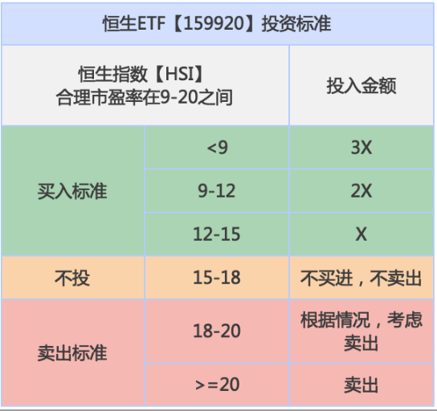

## 总结

## 核心概念

指数基金：投资于特定股票指数的基金

股票指数：按照一定的标准选出一定数量的股票并反映这些股票总体价格变动的指标

## 两大特点

* 永生不死
* 长期上涨

长期年化收益率能保持在10%左右

底层逻辑是：

GDP=各产业总产值-各产业中间投入，创造各产业总产值的主要是居民、企业和政府，其中企业又是效率最高的，所以社会综所有企业的整体收益率一定是大于GDP增长率的。

在社会所有企业中，只有达到一定标准的一小部分企业才能上市，所以所有上市公司的整体收益率一定是大于所有企业的整体收益率的。在所有上市公司中，又会根据更高的标准选出一部分公司构成不同的指数，比如沪深 300 指数，上证红利指数等，所以这些指数的收益率也一定会大于所有上市公司的整体收益率。相应的，这些指数对应的指数基金的收益率也一定会大于所有上市公司的整体收益率。 

结论：指数基金的收益率 >所有上市公司的整体收益率>所有企业的整体收益率>GDP 增长率

一般来说，指数基金的长期年化收益率是 GDP 增长率的 2-3 倍，不同国家不太一样。所以长期来看，指数基金的年化收益率保持在 10%左右是没有问题的。 

这个几乎是确定性的收益，对我们的人生规划、资产配置、财富传承具有极其重要的意义。

## 指数基金4大核心功能

1. 作为投资赚钱的工具

   长期年化收益率10%-15%，既能分红，又能赚价差

2. 作为子女教育金的管理工具

   由于指数基金具有永生不死，长期上涨，收益较高的特点，再加上子女教育金的使用时间一般要在 10年甚至是 15 年之后，短期内不会使用，所以指数基金就特别适合来管理子女教育金。 从 10-15 年的持有期限来看，只要买入指数基金时的估值不高，不但没有亏损的可能，还能获得远超银行定存和保险的收益。

3. 作为养老金的管理工具

   社保的退休金在未来只能让人维持基本生存，根本无法过上有品质的生活。

   商业养老保险所交保费和未来可以领取的养老金的金额，你会发现你所交的保费收益率其实并不高。

   不但没风险，收益还比保险公司高很多

4. 作为财务传承的工具

   财富传承的主要风险有：子孙后代的挥霍、子孙后代投资亏损、子孙后代被骗、通货膨胀。

   怎么化解这些风险呢？通过信托+指数基金的组合就可以了

   信托的钱越来越多，可以富过十代

## 指数基金主要风险

1. 市场风险

   因股市大幅下跌导致指数基金价格大幅下跌的风险

   化解方式：在好价格买进

2. 流动性风险

   场内指数基金由于规模小，日成交金额较小，导致不能顺利卖出的风险

   化解方式：买日成交金额大于1亿的指数基金

## 指数基金注意事项

1. 买估值低的，不买估值高的
2. 买管理费低的，不买管理费高的
3. 买流动性好的，不买流动性差的
4. 只做长期投资，不做短期投机

## 指数基金投资方法

1. 选出合适的指数基金
2. 等待好价格
3. 买进
4. 长期持有
5. 卖出

### 1. 选出合适的指数基金

**指数基金的类型**

**按跟踪的资产类别分类**：股票指数、债券指数、商品指数、外汇指数。

只有股票指数基金最有长期投资价值。

从210年时间跨度看投资收益：股票>>>>>长期债券>>黄金>>现金（外汇）

**按投资策略分类**：完全复制型指数基金（被动性指数基金）、增强型指数基金。

完全复制型指数基金：

* 被动性指数基金完全跟踪指数，目标是获得和指数一样的收益

* 基金经理不进行任何高抛低吸操作，或没有基金经理

增强型指数基金：

* 在原有跟踪指数的基础上，通过基金经理的主动管理即高抛低吸，期望获得高于指数的收益

* 必须设置基金经理岗位

* 90%的增强型指数基金收益率是低于完全复制型指数基金的

* 管理费一般比完全复制型指数基金高很多

**按选样标准分类**：宽基指数基金、窄基指数基金。

宽基指数基金都是具备“永生不死，长期上涨”这个特点的，但窄基指数基金不一定具备这个特点。

因为窄基指数基金跟踪的是某一个行业或主题，而这个行业或主题在长期可能会消亡。即使某个行业长期不会消亡，但它也很可能不会长期上涨，比如钢铁行业。 

当然窄基指数基金也不是一定不能投资，比如中国随着人口老龄化的加剧，我们知道医药行业在未来 

30 年有着很好的机会，那么医药行业指数基金在未来 30 年就有着确定性的机会。 

如果你要买窄基指数基金，那么你首先一定要非常深入的了解某个行业或主题的未来发展，如果你不了 

解，那么很简单，买宽基指数基金就可以了。 

**按交易方式分类**：场内交易指数基金和场外交易指数基金。

一般来说场内指数基金的交易成本要低于场外的

**选择指数基金的条件**：

1. 股票型指数基金
2. 完全复制型指数基金
3. 宽基指数基金
4. 场内指数基金

**指数编制方案查询**

可以在中证指数有限公司官网（http://www.csindex.com.cn/）查看或下载

重点关注：样本空间、选样方法、指数定期调样

**人民币指数基金**

看市值：

* 沪深300ETF(SH:510300)
  * 跟踪沪深300指数(SH:000300)
  * 上市公司中最优秀的钱20%的公司
* 上证50ETF(SH:510050)
  * 跟踪上证50指数(SH:000016)
  * 从上交所上市的公司中选出最优秀的50家公司
* 中证500ETF(SH:510500)
  * 跟踪中证500指数(SH:000905)
  * 先剔除沪深300指数中包含的公司，然后在剩下的公司里再选出前500名的公司

看股息率

* 红利ETF(SH:510880)
  * 跟踪上证红利指数(SH:000015)
  * 在上交所上市的过去2年股息率最高的50家公司
  * 因分红率高，现金流多，适合实现财务自由、养老金管理、财富传承

香港市场

* H股ETF(SH:510900)
  * 跟踪恒生中国企业指数(HK:HSCEI)
  * 由规模最大的50只H股构成
  * H股：在中国内地注册成立但在香港上市的公司
* 恒生ETF(SZ:159920)
  * 跟踪恒生指数(HK:HSI)
  * 在香港上市的50家最大的公司

美国市场

* 标普500ETF(SH:513500)
  * 跟踪标普500指数(代码：.INX)注意有个点
* 纳指ETF(SH:513100)
  * 跟踪纳斯达克100指数(代码：.NDX)注意有个点

**港元指数基金**

* 盈富基金(HK:02800)
  * 跟踪恒生指数(HK:HSI)
* 华夏沪深三百(HK:03188)
  * 跟踪沪深300指数(SH:000300)
* 南方A50
  * 跟踪富时中国A50指数(SH:512550)
* 南方两倍看空恒指
  * 以2倍杠杆做空恒生指数
  * 投机工具，风险很大
* 安硕A50
  * 跟踪富时中国A50指数
* 恒生中国企业
  * 跟踪恒生中国企业指数(HK:HSCEI)

**美元指数基金**

* 标普500ETF-SPDR(代码:SPY)
  * 跟踪标普500指数(代码:.INX)
  * 标普500指数公司入选标准：一个行业的领导者，不限公司的市值规模，不仅有大公司（约占90%），还有很多中型公司（约占10%）
  * 标普500指数是目前追踪资金最多的指数，超过1万亿美元
* 标普500ETF-iShares(代码:IVV)
  * 同上，只是发行公司不同，年费和流动性有区别，但差别很小
* 纳指100ETF(代码:QQQ)
  * 跟踪纳斯达克100指数（代码:.NDX)
  * 在纳斯达克股票市场上市的100家非金融公司
  * 前10大权重股中有9家是高科技公司，并且占了50%左右的权重，所以被看作是科技公司指数
* 纳斯达克指数三倍做多ETF-ProShares
  * 三倍做多纳斯达克100指数
  * 上了3倍杠杆的投资性指数基金
* 罗素2000指数ETF
  * 跟踪罗素2000指数
  * 由美国股市中2000家中小市值的上市公司构成
  * 基本都不是行业的领导者，也算不上是好公司

从过去长期年化收益率排名来看，QQQ>盈富基金>红利 ETF>300ETF>SPY

这几只指数基金我们应该买哪个呢？主要看价格，哪个价格最好，就买哪个。

### 2. 等待好价格

和股票一样，指数基金的好价格都是市场给的，一般 5-10 年才会出现一次真正的好价格。

在好价格没出现的时候我们能做的就是买入其他投资工具，当然也可以进行指数基金定投。当好价格出现的时候，我们就可以大量买进指数基金。

在我们选出的指数基金中有人民币的、港币的、美元的，这些指数基金的好价格出现的周期是不同的，所以我们有可能 3-5 年就能遇到一次指数基金的好价格。

指数基金的好价格其实就是指数的低估区间，只要我们能够分析出指数是不是处在低估区间，我们自然就知道指数基金是不是处在好价格。

通过市盈率就可以知道指数现在有没有低估

由于指数是由一篮子股票组成的，即使有个别公司利润造假也不会影响指数中所有公司的整体净利润， 所以指数的市盈率比个股的市盈率要可靠的多，也有效的多。

* 沪深300ETF
  * 参考条件：沪深300指数市盈率
  * PE<10:适合买入
  * PE>30:适合卖出
* 红利ETF
  * 参考条件：上证红利指数市盈率
  * PE<7：适合买入
  * PE>30：适合卖出
* 盈富基金
  * 参考条件：恒生指数市盈率
  * PE<9：适合买入
  * PE>20：适合卖出
* 标普500指数ETF-SPDR
  * 参考条件：标普500指数市盈率
  * 美国10年期国债收益率小于4%
    * PE<15：适合买入
    * PE>25：适合卖出
  * 美国10年期国债收益率大于4%
    * PE<10：适合买入
    * PE>20：适合卖出

* 纳指100ETF
  * 参考条件：纳斯达克100指数市盈率
  * PE<15：适合买入
  * PE>30：适合卖出

### 3. 买进

* 在好价格大量买进
  * 适合有一定资金量的投资者
  * 当市盈率出现极度低估时，尽可能多的买进，长期持有
  * 买进步骤
    1. 闲置资金三等分
    2. 指数低估时买入一份资金
    3. 买入后下跌10%再次买入一份
    4. 知道资金买完
* 在低估区间定投
  * 适合现阶段存款不多的投资者
  * 举例：当红利指数市盈率小于7时，红利指数处于低估区间，做定投

### 4. 长期持有

买进指数基金后，要做的就是长期持有

### 5. 卖出

目的不同，卖出标准不同

1. 作为投资赚钱的工具

   目的：收益最大化

   * 300ETF，沪深300指数市盈率大于30时卖出
   * 红利ETF，上证红利指数市盈率大于30时卖出
   * 盈富基金，恒生指数市盈率大于20时卖出
   * 标普500指数ETF-SPDR，标普500指数市盈率大于25时卖出
   * 纳指100ETF，纳斯达克100指数市盈率大于30时卖出

2. 作为子女教育金的管理工具

   目的：特定期限内收益较大化

   最长持有18-20年算，在持有12年之后，选择在一个较高市盈率卖掉，比如市盈率大于25卖掉。然后买入货币基金

3. 养老金管理工具

   目的：分红的持续性和增长性

   一般不用卖出指数基金，除非指数出现十几年一遇的极度高估，比如红利指数市盈率大于40。因为这种情况下卖掉指数基金，未来在较短时间内能在此买回指数基金的可能性才较大。如果高估就卖掉，可能要等好多年才能有机会再次买进。

   对于养老金来说，确定性远比收益性重要，所以能不卖就不卖

4. 财富传承的工具

   目的：财产独立性和收益确定性最重要

   信托+指数基金的组合是一个确定能富过五代甚至十代的财富传承方案

   根本不用卖出，让信托一直持有下去就可以了
   
   信托保证财产的独立性，指数基金保证财产收益的确定性。对于财富传承来讲，财富传承的时间长度远远比收益率重要的多，哪怕长期只获得10%的年化收益率，财富传承到第五代也已经是天文数字。